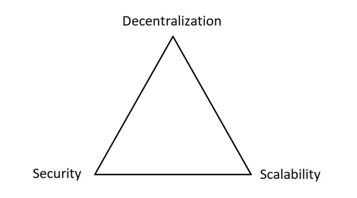

# 🥭 Blockchain alternative

### **Il Trilemma**  

Il **Trilemma della Blockchain** afferma che la blockchain perfetta è: **sicura**, **scalabile** e **decentralizzata**, ma che **nessuna blockchain** è in grado di **soddisfare tutti e tre** questi parametri.

<figure><figcaption></figcaption></figure>

\
La **tecnologia** blockchain si è **evoluta** nel tempo attraverso soluzioni di **nuova generazione** e con migliori **funzionalità tecniche**, che hanno l'obiettivo di **superare** il **Trilemma**.

Questo tentativo è la motivazione alla base della nascita di blockchain delle "alternative".

Queste blockchain hanno scelto tra tre possibili approcci:

* sviluppare l'ambiente **Layer 0**, nel quale è possibile ospitare svariati Layer 1, e le dApps sopra di essi (esempio: Polkadot)
* sviluppare la Blockchain **Layer 1** sulla quale le dApps funzionano (esempio: Solana)
* sviluppare il **Layer 2** sopra un Layer 1, ad esempio per aumentarne la velocità (esempio: Arbitrum)

### **Layer 0** 

\
Un **Layer 0** assomiglia a una "rete di reti".

E' un tipo di rete che consente agli sviluppatori di **lanciare più blockchain** (Layer 1), che possono essere progettate per servire ciascuna uno **scopo specifico**, e soddisfare una o due dimensioni del trilemma della blockchain, **anziché tutte e tre**.

Il vantaggio di questo approccio è che tutte le L1 possono **condividere la sicurezza** ereditata dal Layer 0, e non preoccuparsi degli algoritmi di consenso, ma **concentrarsi** sul creare un'**esperienza utente** efficace.

Queste blockchain Layer 1 sono tutte **collegate** alla rete principale (Layer 0) ed in grado di **comunicare** tra loro, ma operano in modo **indipendente.**

Ciascun Layer 0 è dotato di un'implementazione e di un **approccio** unici per consentire agli sviluppatori di lanciare le proprie blockchain.

I layer 0 più importanti sono **Cosmos** e **Polkadot**.

### **Layer 1** 

Per Layer 1 si intende una blockchain vera e propria, **responsabile** dell'esecuzione dei compiti che mantengono le **operazioni fondamentali** di una rete, come il **meccanismo di consenso**, i linguaggi di **programmazione**, i **protocolli** e le restrizioni.

Il gran numero di servizi che il Layer 1 deve offrire causa spesso problemi di **scalabilità**.

Quanti più utenti entrano sulla rete, tanto maggiore è la quantità di potenza di calcolo richiesta, con conseguenti costi più elevati e tempi di elaborazione più lunghi.

Il problema della **scalabilità** viene **mitigato** dai Layer 1 con l'applicazione di tecnologie come lo Sharding e dal supporto di blockchain Layer 2.

**Ethereum**, **Solana** e **Binance Smart Chain**, sono esempi di Layer 1.

### **Layer 2**

Un **Layer 2** (L2) è una blockchain separata, **costruita sopra** un’altra blockchain definita **Layer 1** (nel nostro caso Ethereum), che ne eredita le **garanzie di sicurezza** e ne migliora la **scalabilità**, **l’efficienza** e la **velocità.**

#### I vantaggi di un Layer 2 

* **Commissioni più basse**: Combinando più transazioni **off-chain** in un'unica transazione, le commissioni vengono **ridotte in modo massiccio**, rendendo **Ethereum** più **accessibile** a tutti.
* **Sicurezza**: I **Layer 2** regolano le loro transazioni su **Ethereum**, consentendo agli utenti di **beneficiare** della sicurezza della rete principale.
* **Maggiore sviluppo**: Con maggiore **velocità** di transazione, **commissioni basse** e nuove **tecnologie**, verranno sviluppate sempre più **applicazioni decentralizzate**.

I layer 1 (di Ethereum) più usati sono **Arbitrum** e **Optimism**. ****&#x20;
